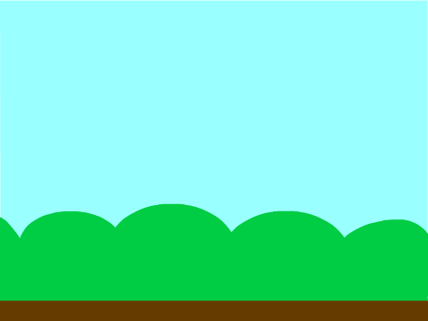
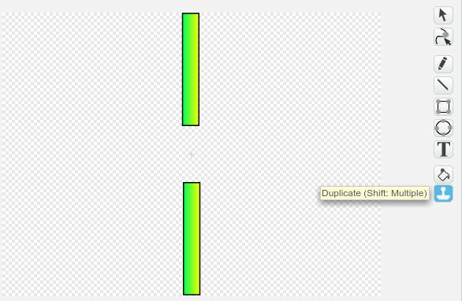

## Add the backdrop and pipes

First, let's create the pipes.

+ Open a new empty Scratch project.

[[[generic-scratch-new-project]]]

+ Add a background with an outdoor scene or landscape. 'blue sky' is a good choice.

    

[[[generic-scratch-backdrop-from-library]]]

+ Click on the **Paint new sprite** button.

+ Name your sprite `Pipes`.

[[[generic-scratch-rename-sprite]]]

The `Pipes` sprite will be a pair of pipes with a gap in the middle. You'll be able to move the sprite up and down to position the gap in a different place.

Let's take a look at how this is going to work. This picture shows an example of how the pipes could be positioned. The parts outside the stage are normally hidden, you only see them when you drag the sprite:

    

You can't draw a pipe as big as the pipes need to be, but you can increase the size of a sprite when it's used.

+ Add code to make the sprite bigger. This will make it easier to see how big you need to make the pipes.

    

+ Switch the paint tool to vector mode.

[[[generic-scratch-vector-mode]]]

+ Draw a rectangular black outline for the top pipe as shown:

    

+ Shade your pipe with a left-to-right gradient.

    

[[[generic-scratch-vector-gradient]]]

+ Click on the **Duplicate** tool and then on your pipe to create a copy.

    Drag the copy of the sprite to the bottom of the screen, in line with the top sprite.

    

+ If you like, you can add extra shaded rectangles to the ends of the pipes:

    
