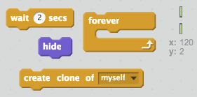
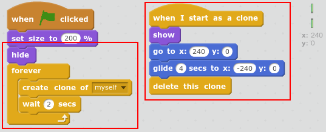

## Make the pipes move

Next you'll get the pipes moving across the screen to create an obstacle course.

+ Create a clone of your 'Pipes' sprite every 2 seconds. Each clone should scroll across the stage from right to left (towards the parrot).

__Tip:__ You can stop the pipes scrolling by clicking the red stop button.

--- hints --- --- hint ---
When the __green flag is clicked__, the 'Pipes' sprite should __hide__. The sprite can then __create a clone__ and __wait__ for 2 seconds. This should be repeated __forever__.

__When started__, each clone should __go to__ the far-right of the stage, __show__ and then __glide__ back towards the left of the stage before being __deleted__.
--- /hint --- --- hint ---
Here are the code blocks you'll need to create a clone every 2 seconds:

Here are the code blocks you'll need to make each clone move across the stage:

--- /hint --- --- hint ---
This is what your code should look like:

--- /hint --- --- /hints ---

+ Now you should have lots of pipes, but the gap is always in the same place. Add some variety by putting the gap between each set of pipes at a different height.

--- hints --- --- hint ---
Each newly created __clone__ should __go to__ a __random__ y position. The clone should then glide across the stage, using the clone's __y position__ to keep it moving in a straight line.
--- /hint --- --- hint ---
You'll need to use these 2 extra blocks:

--- /hint --- --- hint ---
This is what your code should look like:

--- /hint --- --- /hints ---
